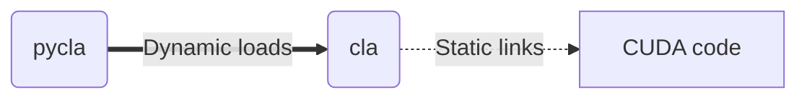
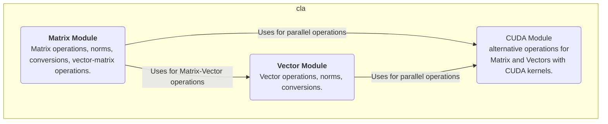
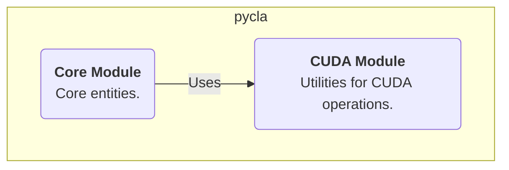

<h1 align="center">
  

  
  
  
  

  C Linear Algebra (CLA) Library
   
</h1>

  <a href="#features">Features</a> •
  <a href="#quick-start">Quick Start</a> •
  <a href="#build">Build</a> •
  <a href="#architecture">Architecture</a>

CLA is a simple toy library for basic vector/matrix operations in C. This project main goal is to learn the foundations of [CUDA](https://docs.nvidia.com/cuda/), and Python bindings, using [`ctypes`](https://docs.python.org/3/library/ctypes.html) as a wrapper, through simple Linear Algebra operations (additions, subtraction, multiplication, broadcasating, transformations, etc). 

# Features

- C17 support, Python 3.13, CUDA 12.8;
- Windows and Linux support;
- Vector-vector operations;
- Matrix-matrix operations;
- Matrix-vector and vector-matrix operations;
- Inversion, norms and orthogonalization;
- Device selection to run operations;

# Quick Start

## C API

TODO

## Python API

TODO

# Build

TODO

## Requirements

TODO

# Architecture

The library is organized as simply as possible. The goal is to make a slight distinction between the C and Python APIs, while allowing the core code with CUDA to be flexible.

The C API provides a shared library named `cla` to be used by other programs/libraries during the linking stage or runtime. This C library is static linked to the CUDA kernel/functions during build.

The Python API provides a wrapper to the `cla` library by a Python package named `pycla`, which dynamics load the `cla` library during runtime. It is necessaary to have the CUDA runtime available to use CUDA-related functionanilty.

The aforementioned relationship is depicted in the diagram below:

## Directory structure

The source code is organized as follows:

- [`build`](build): build-related files, not versioned by Git;
- [`cla`](cla): source code for the C API;
  - [`include`](cla/include): header files (i.e., `.h`, `.cuh`), has subdirectories for each module (e.g., `cuda`, `vector`, `matrix`);
  - [`matrix`](cla/matrix): matrix module;
  - [`vector`](cla/vector): vector module;
  - [`cuda`](cla/cuda): CUDA related code;
- [`pycla`](pycla): source code for the Python API;

## `cla` library

The following diagram shows the module/package organization.

## `pycla` library

The following diagram shows the module/package organization.

