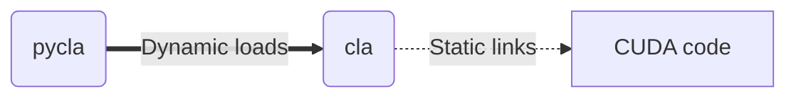
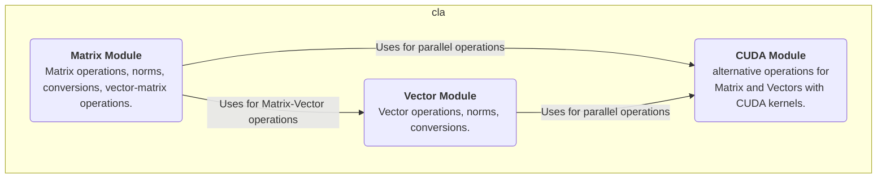
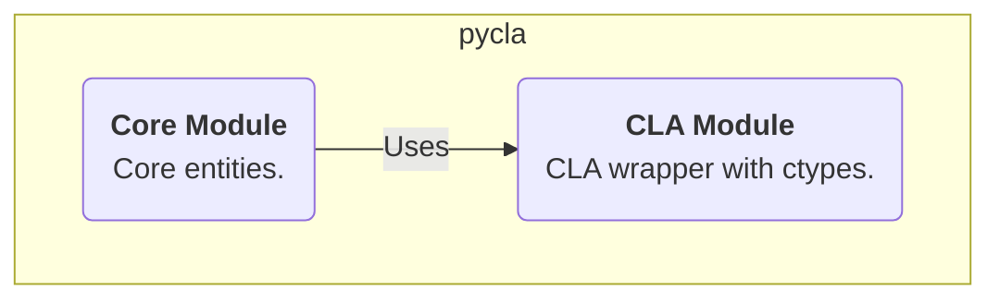

<h1 align="center">
  

  
  
  
  

  C Linear Algebra (CLA) Library
   
</h1>

  <a href="#features">Features</a> •
  <a href="#quick-start">Quick Start</a> •
  <a href="#build">Build</a> •
  <a href="#architecture">Architecture</a>

CLA is a simple toy library for basic vector/matrix operations in C. This project main goal is to learn the foundations of [CUDA](https://docs.nvidia.com/cuda/), and Python bindings, using [`ctypes`](https://docs.python.org/3/library/ctypes.html) as a wrapper, through simple Linear Algebra operations (additions, subtraction, multiplication, broadcasating, transformations, etc). 

# Features

- C17 support, Python 3.13, CUDA 12.8;
- Linux support;
- Vector-vector operations;
- Matrix-matrix operations;
- Vector and matrix norms;
- GPU device selection to run operations;
- Get CUDA information from the system (i.e., support, number of devices, etc);
- Management of memory (CPU memory vs GPU memory), allowing copies between devices;

# Quick Start

## Installation

For the C-only API, obtain the latest binaries and headers from the [releases](https://github.com/moesio-f/cla/releases) tab in GitHub. For the Python API, use your favorite package manager (i.e., `pip`, `uv`) and install `pycla` from PyPi (e.g., `pip install pycla`).

## C API

The C API provides structs (see [`cla/include/entities.h`](cla/include/entities.h)) and functions (see [`cla/include/vector_operations.h`](cla/include/vector_operations.h), [`cla/include/matrix_operations.h`](cla/include/matrix_operations.h)) that operate over those structs. The two main entities are `Vector` and `Matrix`. A vector or matrix can reside in either the CPU memory (host memory, from CUDA's terminology) or GPU memory (device memory). Those structs always keep metadata on the CPU (i.e., shape, current device), which allows the CPU to coordinate most of the workflow. In order for an operation to be run on the GPU the entities must first be copied to the GPU's memory.

For a quickstart, compile the [samples/c_api.c](samples/c_api.c) with: (i) `gcc -l cla <filename>.c`, if you installed the library system-wide (i.e., copied the headers to `/usr/include/` and shared library to `/usr/lib/`); or (ii) `gcc -I <path-to-include> -L <path-to-root-wih-libcla> -l cla <filename>.c`. 

To run, make the `libcla.so` findable by the executable (i.e., either update `LD_LIBRARY_PATH` environment variable or include it on `/usr/lib`) and run in the shell of your preference (i.e., `./a.out`).

## Python API

The Python API provides an object-oriented approach for using the low-level C API. All features of the C API are exposed by the [`Vector`](pycla/core/vector.py) and [`Matrix`](pycla/core/matrix.py) classes. Some samples are available at [`samples`](samples) using Jupyter Notebooks. 

# Build

The whole library can be built using the `make` targets defined on the [Makefile](Makefile). All you have to do is make the required libraries available on the system (i.e., install CUDA 12.8, Python 3.13, gcc/g++ 17, CMake 4.0.0) and install the Python libraries for development (i.e., [py-dev-requirements](py-dev-requirements.txt)). The table below describes the main targets that can be run with `make <target>`.

| Target | Description |
| --- | --- |
| `all` | Prepare and compile the `CLA` library and install the library (`.so`) in [`pycla.bin`](pycla/bin) |
| `test` | Run all unit tests for `cla` and `pycla`. |
| `release` | Run tests for `cla` and `pycla` and create release files (i.e., Python wheel and C zip file). |
| `clean` | Utility target that removes the CMake build directory. |
| `test-cla-memory-leak` | Runs Valgrind and CUDA compute sanitizer for memory leaks in the C API. |
| `test-pycla` | Run tests for the Python API only. | 

# Architecture

The library is organized as simply as possible. The goal is to make a slight distinction between the C and Python APIs, while allowing the core code with CUDA to be flexible.

The C API provides a shared library named `cla` to be used by other programs/libraries during the linking stage or runtime. This C library is static linked to the CUDA kernel/functions during build.

The Python API provides a wrapper to the `cla` library by a Python package named `pycla`, which dynamics load the `cla` library during runtime. It is necessaary to have the CUDA runtime available to use CUDA-related functionanilty.

The aforementioned relationship is depicted in the diagram below:

## Directory structure

The source code is organized as follows:

- [`cla`](cla): source code for the C API;
  - [`include`](cla/include): header files (i.e., `.h`, `.cuh`), has subdirectories for each module (e.g., `cuda`, `vector`, `matrix`);
  - [`matrix`](cla/matrix): matrix module;
  - [`vector`](cla/vector): vector module;
  - [`cuda`](cla/cuda): CUDA management code;
- [`pycla`](pycla): source code for the Python API;
  - [`bin`](pycla/bin): wrapper for the `cla` shared library;
  - [`core`](pycla/core): core entities;

## `cla` library

The following diagram shows the module/package organization.

## `pycla` library

The following diagram shows the module/package organization.

